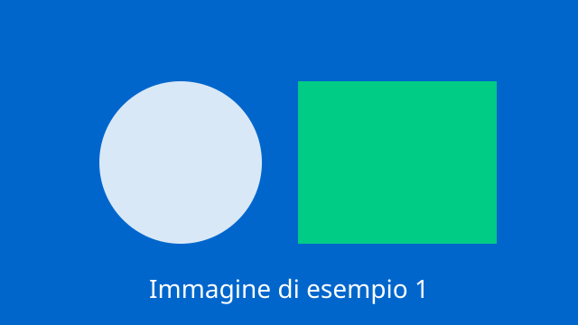
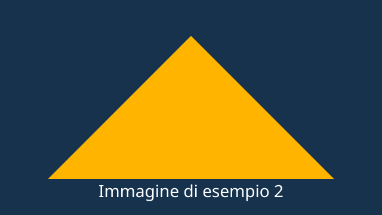

Questa pagina raccoglie i tipi di contenuto che Quarto sa produrre, per verificare che il tema li renda in modo coerente con il design system. Serve da banco di prova quando si aggiorna il tema.

## Testo

Testo normale con **grassetto**, *corsivo*, ~~barrato~~, `codice inline`, un [collegamento interno](/servizi.html) e uno [esterno](https://designers.italia.it). Una nota a piè di pagina[^1] e un riferimento a una sezione: vedi @sec-tabelle.

[^1]: Il testo della nota a piè di pagina.

> Una citazione a blocco, con testo abbastanza lungo da mandare a capo e verificare l'interlinea e il margine sinistro.

Termine
: Definizione del termine, nella sintassi delle liste di definizione.

Altro termine
: Seconda definizione.

## Titoli

# Titolo di livello 1

## Titolo di livello 2

### Titolo di livello 3

#### Titolo di livello 4

##### Titolo di livello 5

###### Titolo di livello 6

## Liste

Elenco puntato:

- primo elemento
- secondo elemento
  - annidato
  - annidato
- terzo elemento

Elenco numerato:

1. primo
2. secondo
3. terzo

Elenco di cose da fare:

- [ ] da fare
- [x] fatto

## Immagini e figure

{#fig-esempio width=70% fig-alt="Rettangolo blu con un cerchio bianco e un quadrato verde"}

Riferimento incrociato alla figura: @fig-esempio.

Due figure affiancate:

::: {layout-ncol=2}
{#fig-prima fig-alt="Rettangolo blu con un cerchio bianco e un quadrato verde"}

{#fig-seconda fig-alt="Rettangolo blu scuro con un triangolo giallo"}
:::

## Tabelle {#sec-tabelle}

| Comune | Provincia | Abitanti |
|--------|-----------|---------:|
| Palermo | PA | 630.828 |
| Catania | CT | 298.762 |
| Messina | ME | 218.786 |

: Popolazione dei comuni {#tbl-comuni}

Riferimento incrociato alla tabella: @tbl-comuni.

## Codice

```python
def saluta(nome):
    """Restituisce un saluto."""
    return f"ciao {nome}"
```

Codice con numeri di riga:

```{.python .numberLines}
totale = 0
for riga in righe:
    totale += riga.importo
print(totale)
```

Codice richiudibile:

```{.python code-fold="true" code-summary="Mostra il codice"}
import pandas as pd

df = pd.read_csv("comuni.csv")
df.groupby("provincia").size()
```

Codice con il nome del file:

```{.python filename="analisi.py"}
comuni = leggi("comuni.csv")
```

Codice con annotazioni:

```python
import pandas as pd            # <1>
df = pd.read_csv("comuni.csv") # <2>
```

1. Si importa la libreria.
2. Si legge il file dei comuni.

## Schede

::: {.panel-tabset}

### Prima scheda

Contenuto della prima scheda.

### Seconda scheda

Contenuto della seconda scheda.

:::

## Colonne

::: {.columns}

::: {.column width="48%"}
Colonna di sinistra, con il testo che scorre su più righe per vedere come si comporta la larghezza.
:::

::: {.column width="4%"}
:::

::: {.column width="48%"}
Colonna di destra, anche questa con un po' di testo.
:::

:::

## Callout

::: {.callout-note}
Callout di tipo `note`, senza titolo.
:::

::: {.callout-tip title="Suggerimento"}
Callout di tipo `tip`, con titolo.
:::

::: {.callout-warning title="Attenzione"}
Callout di tipo `warning`.
:::

::: {.callout-caution title="Avvertenza"}
Callout di tipo `caution`.
:::

::: {.callout-important title="Importante"}
Callout di tipo `important`.
:::

::: {.callout-note collapse="true" title="Callout richiudibile"}
Il contenuto compare quando si apre: è il callout richiudibile del design system.
:::

::: {.callout-tip appearance="simple" title="Senza riquadro"}
Callout con `appearance="simple"`: solo la barra laterale, senza riquadro.
:::

::: {.callout-warning icon=false title="Senza icona"}
Callout con `icon=false`.
:::

## Formule

Formula in linea: $E = mc^2$.

Formula a blocco:

$$
\sum_{i=1}^{n} x_i = x_1 + x_2 + \dots + x_n
$$

## Componenti di Bootstrap Italia

Accanto ai contenuti di Quarto si possono usare le classi del design system.

::: {.row}

::: {.col-12 .col-md-6}
::: {.card-wrapper .card-space}
::: {.card .card-bg}
::: {.card-body}
### Card

Testo della card, con il font di lettura del design system.

[Leggi di più](#){.read-more}
:::
:::
:::
:::

::: {.col-12 .col-md-6}
::: {.card-wrapper}
::: {.card .card-teaser .shadow}


::: {.card-body}
### Card teaser

La variante compatta, con icona a sinistra.
:::
:::
:::
:::

::: {.col-12}
::: {.btn-group role="group"}
[Primario](#){.btn .btn-primary}
[Secondario](#){.btn .btn-outline-primary}
:::

::: {.progress .mt-4}
::: {.progress-bar role="progressbar" aria-label="Avanzamento della pratica" style="width: 60%" aria-valuenow="60" aria-valuemin="0" aria-valuemax="100"}
:::
:::

Etichette (chip), nelle varianti del design system:

::: {.chip .chip-simple .mt-4}
[Etichetta]{.chip-label}
:::
::: {.chip .chip-simple .chip-primary .mt-4}
[Primaria]{.chip-label}
:::
::: {.chip .chip-simple .chip-success .mt-4}
[Successo]{.chip-label}
:::
::: {.chip .chip-simple .chip-danger .mt-4}
[Errore]{.chip-label}
:::
::: {.chip .chip-lg .chip-simple .chip-primary .mt-4}
[Grande]{.chip-label}
:::

Badge:

[Nuovo]{.badge .bg-primary} [In corso]{.badge .bg-warning} [Concluso]{.badge .bg-success} [Scaduto]{.badge .bg-danger} [Bozza]{.badge .badge-outline-secondary} [12]{.badge .bg-primary .rounded-pill}
:::

:::

## Diagrammi

```{mermaid}
flowchart LR
  A[Richiesta] --> B{Serve SPID?}
  B -->|sì| C[Accesso]
  B -->|no| D[Modulo pubblico]
```
